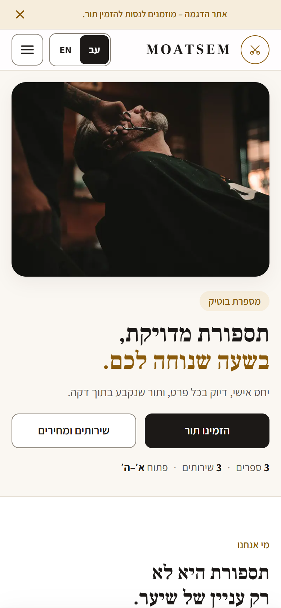
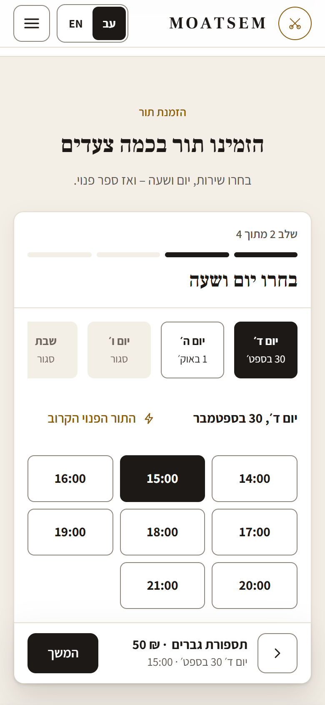
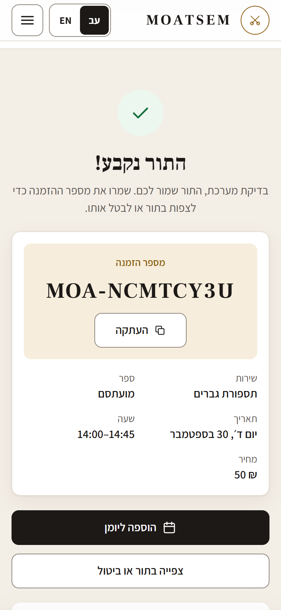
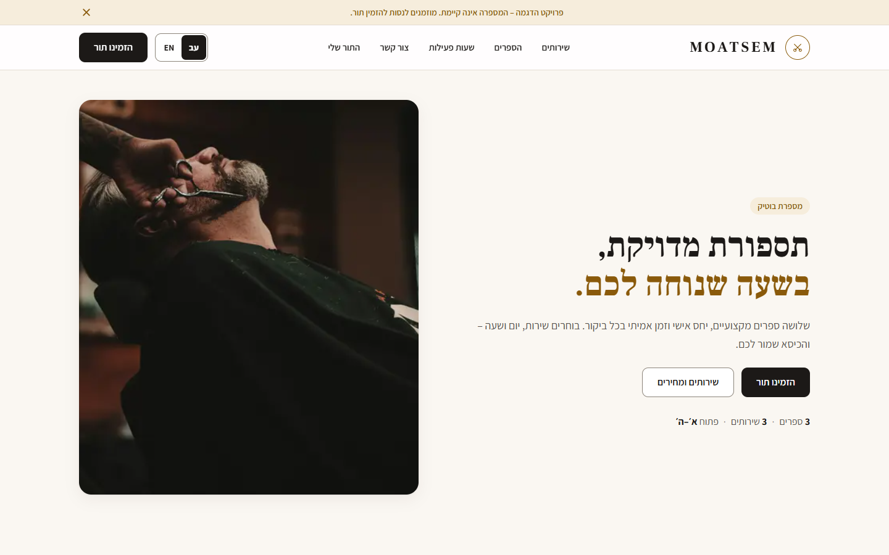

# MOATSEM — Barbershop Booking App

A bilingual (English / Hebrew) barbershop website with real-time online booking, built with Next.js, Supabase and Resend.

> **Demo project.** The barbershop is fictional. You can make and cancel test bookings on the live demo.

**Live demo:** https://barber-booking-ruddy.vercel.app

## Screenshots

Hebrew (the default language, right-to-left). Phones at 390 px, desktop at 1440 px.

| Home (mobile) | Booking flow | Confirmation |
|:---:|:---:|:---:|
|  |  |  |

**Desktop home**



## Features

- **Online booking:** choose a service, date, time and barber, with live per-barber availability (available / booked / unavailable).
- **Double-booking protection** enforced by the database, not just the UI (see below).
- **Manage booking:** look up or cancel an appointment with a booking reference (e.g. `MOA-7K4P9X2Q`) and email. No account needed.
- **Contact form:** messages are stored in the database and emailed to the shop.
- **Email notifications** through Resend: booking and cancellation emails for the shop, and localized confirmations for the customer.
- **English and Hebrew** with a full right-to-left layout. The language choice is remembered in a cookie and applies to emails too.
- **Shop-timezone logic:** every availability and "is this in the past?" check uses `Asia/Jerusalem`, whatever the server's timezone.
- **Server-side validation** of all input in Server Actions. Secrets never reach the browser.

## Tech stack

| Area | Technology |
|---|---|
| Framework | Next.js 16 (App Router, Server Actions, Turbopack) |
| Language | TypeScript (strict) |
| UI | React 19, Tailwind CSS 4 |
| Database | Supabase (PostgreSQL) with Row Level Security |
| Email | Resend |
| Tooling | ESLint 9, npm |

## How double-booking is prevented

Two layers work together:

1. **`get_barber_availability` SQL function (for correct UI).** A single Postgres function decides whether each barber is free for a given date, time and service. It checks shop and per-barber working hours, blocked times (holidays, breaks), existing confirmed appointments, the service's duration, and whether the slot is already in the past. The booking UI calls it to show availability. The server calls it **again** immediately before inserting, so the client's earlier view is never trusted.

2. **`EXCLUDE` constraint (the actual guarantee).** A check-then-insert still has a race window: two customers can both see a slot as free. The `appointments` table therefore has a GiST exclusion constraint:

   ```sql
   exclude using gist (
     barber_id with =,
     tstzrange(starts_at, ends_at, '[)') with &&
   ) where (status = 'confirmed');
   ```

   PostgreSQL atomically rejects any second *confirmed* appointment whose time range overlaps another for the same barber, even under concurrent requests. The app catches that error (`23P01`) and tells the user the slot was just taken. Cancelled appointments are excluded, so a cancelled slot becomes bookable again.

`starts_at` / `ends_at` are kept up to date by a trigger that converts the wall-clock date and time to an absolute timestamp in `Asia/Jerusalem`, so the ranges are correct across daylight-saving changes.

## Local setup

**Requirements:** Node.js 20.9+ (22 LTS recommended), npm, a [Supabase](https://supabase.com) project, and a [Resend](https://resend.com) account.

```bash
git clone <this-repo-url>
cd barber-booking
npm ci
cp .env.local.example .env.local   # fill in the values, see below
npm run dev                        # http://localhost:3000
```

**Database:** run the SQL files in `supabase/migrations/` against your Supabase project **in filename order**. You can paste them into the Supabase SQL Editor, or use `npx supabase link` followed by `npx supabase db push`. They create the schema, RLS policies, the exclusion constraint and the availability function, and add demo barbers, services and working hours.

Without Supabase configured, the site still renders and the booking flow can be clicked through, but the final confirmation is disabled.

### Environment variables

| Variable | Secret | Purpose |
|---|---|---|
| `NEXT_PUBLIC_SUPABASE_URL` | No | Supabase project URL |
| `NEXT_PUBLIC_SUPABASE_PUBLISHABLE_KEY` | No | Supabase publishable (anon) key, restricted by RLS |
| `SUPABASE_SERVICE_ROLE_KEY` | **Yes. Server only.** | Server-side access for bookings and contact messages |
| `RESEND_API_KEY` | **Yes. Server only.** | Sending email |
| `RESEND_FROM_EMAIL` | No | Sender address (`onboarding@resend.dev` works for testing) |
| `CONTACT_RECEIVER_EMAIL` | No | Inbox for booking and contact notifications |

### Scripts

| Command | Description |
|---|---|
| `npm run dev` | Development server |
| `npm run build` | Production build |
| `npm start` | Serve the production build |
| `npm run lint` | ESLint |

## Credits

Photos are placeholders. See [`public/images/CREDITS.md`](public/images/CREDITS.md) for sources and licences.
